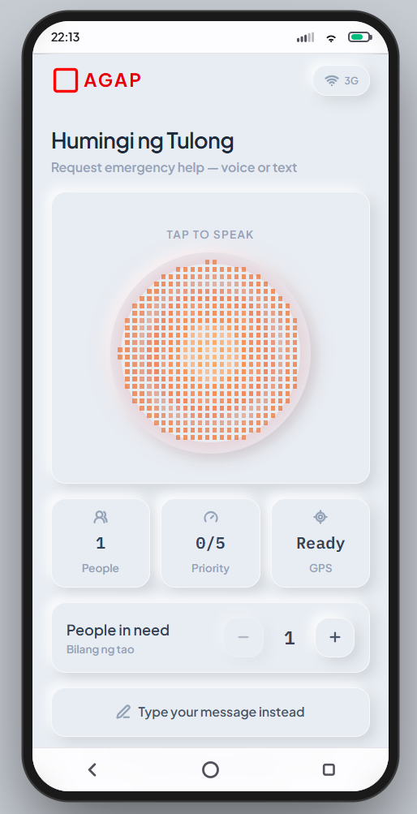
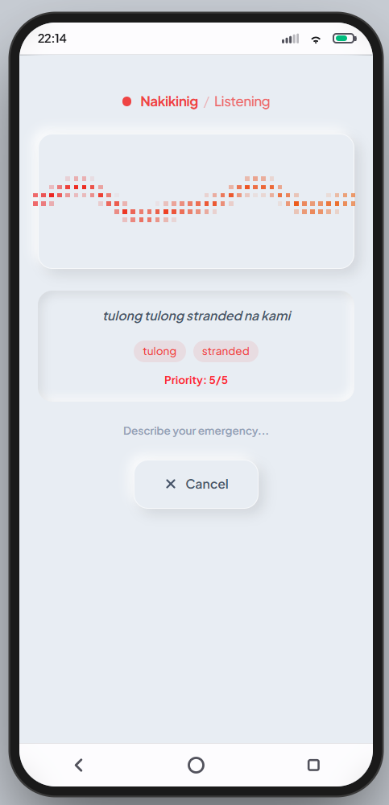
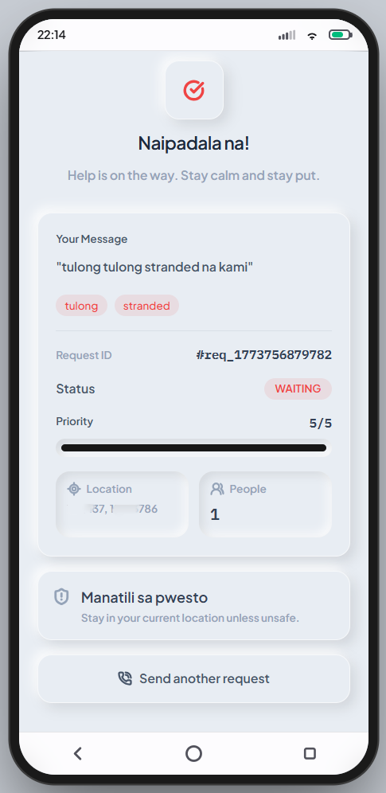
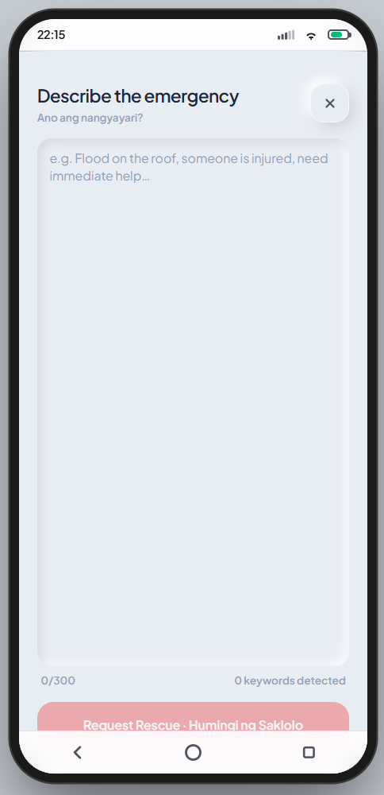
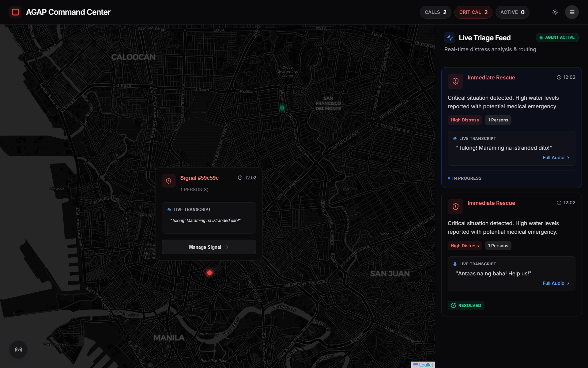
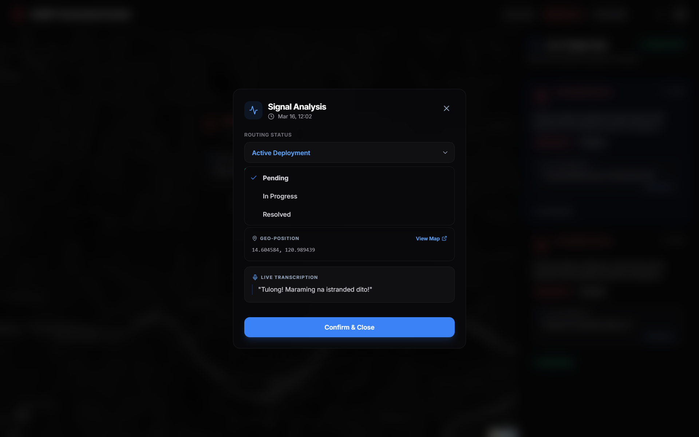
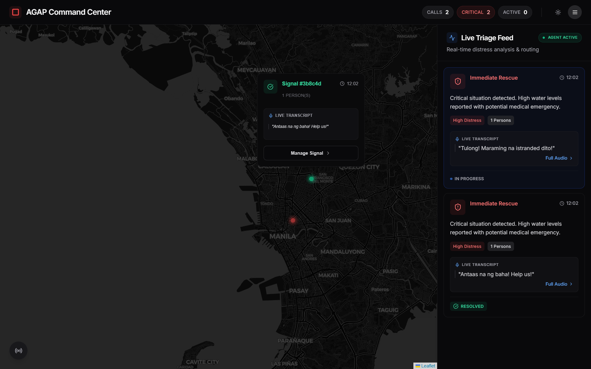

# AGAP: Emergency Response System

**Project**: AGAP (Automated, Georeferenced, and Adaptive platform for Predictive flood rescue)  
**Team**: Bulldog Ni Don Severino  
**AI Voice Provider**: Agora Voice AI

---

## What It Solves

AGAP addresses critical gaps in disaster response during floods and emergencies:

- **Speed**: Citizens can report emergencies via voice in seconds—no need to type when water is rising
- **Accessibility**: Voice-first design reaches people who can't text or use smartphones
- **Precision**: GPS-based locations eliminate vague directions like "near the bridge"
- **Coordination**: Responders see all signals in real-time on a single map, preventing missed requests
- **Offline Resilience**: When networks fail during disasters, the PWA queues requests locally and syncs when connection returns
- **Severity Awareness**: AI analyzes voice to extract keywords and prioritize critical signals
- **Calm Guidance**: An AI voice actively soothes panicked users during the SOS process—speaking calmly, reassuring them that help is coming, and giving clear step-by-step instructions on what to do while they wait for rescue
  **UN SDG**: SDG 11 - Sustainable Cities and Communities

---

## System Workflow

```
CITIZEN (User App)              CLOUD (Supabase)           RESPONDER (Dashboard)
══════════════════              ════════════════           ════════════════════

1. Open app
   ↓
2. Tap SOS button ─────────────────────────────────→ Voice Recognition
   ↓                                                (Real-time)
3. Speak: "Water is rising,
   help me!" ────────────────→ Transcription
   (e.g., "Water is rising,   + Keyword Extraction
   help me!")                 + Priority Scoring
   ↓                          ↓
4. Capture location ─────────→ INSERT distress_signal
   (GPS: 14.5995, 120.9842)   - transcript: "Water..."
   ↓                          - keywords: ["water", "rising"]
5. Confirmation screen        - priority: 4/5
   Shows detected keywords    - location: (14.5995, 120.9842)
   + priority                 ↓
   ↓                          ├─ Realtime CDC event ──────→ 6. Signal appears on map
6. Confirm & send ───────────→ Status: "waiting" ────────→    as pulsing marker
   ↓                          ↓                              ↓
7. Offline?                   └─ Voice alert triggered ──→ 7. Announce: "Critical
   YES: Queue locally                                        signal near Manila"
   NO: Sent immediately       ↓                              ↓
   ↓                          Status: "in-progress" ←────── 8. Responder clicks
8. Confirmation:              Dashboard listens via          signal modal
   "Help is on the way"       Supabase subscription      ↓
   ↓                          ↓                          9. Views full details:
9. Responder updates status   Status: "resolved" ←────────  - Transcript
   on dashboard               All dashboard clients         - Keywords detected
   ↓                          sync instantly               - Priority score
10. User sees: Resolved                                    - Location on map
                                                            - People count
                                                           ↓
                                                        10. Updates status:
                                                            pending →
                                                            in-progress →
                                                            resolved
```

---

## App Overview

### User App (Citizen SOS)

<div>
  <p><strong>Home</strong></p>
  
</div>

---

<div>
  <p><strong>Voice SOS</strong></p>
  
</div>

---

<div>
  <p><strong>Confirmation & Success</strong></p>
  
</div>

---

<div>
  <p><strong>Text Fallback (Voice Unavailable)</strong></p>
  
</div>

---

### Rescuer Dashboard

**Live Map (Pending Signal)**


---

**Signal Details**


---

**Resolved Signal**


---

## Projects

For detailed setup, architecture, and development info, see each project's README:

### 1. [User App (Citizen SOS)](./Source%20Code/agap/user-app/)

Mobile-first PWA for citizens to report emergencies via voice or text.

- **Tech**: Next.js 15, TypeScript, Tailwind CSS, Web Speech API, Geolocation
- **Key Features**: Voice SOS, text SOS, location tracking, priority detection, offline queue, PWA

### 2. [Rescuer Dashboard](./Source%20Code/agap/rescuer-dashboard/)

Real-time command center for emergency responders to track and manage distress signals.

- **Tech**: React 18, Vite, Leaflet, Supabase Realtime, Chart.js
- **Key Features**: Live map, triage feed, signal details, status updates, voice alerts, analytics

---

**For detailed setup instructions, architecture diagrams, and development guides, please refer to the individual project READMEs linked above.**
