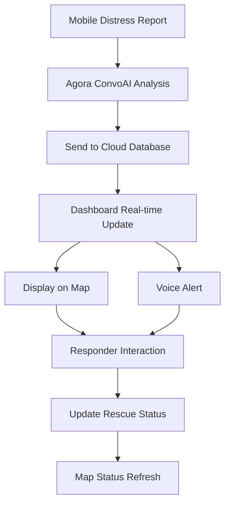

## 1. Product Overview

A real-time rescue dashboard that displays flood emergency locations on an interactive map with voice AI alerts. The system receives distress signals from mobile users and provides emergency responders with visual and audio notifications about people needing rescue.

Target users: Emergency response teams, disaster management authorities, and rescue coordinators who need real-time situational awareness during flood emergencies.

## 2. Core Features

### 2.1 User Roles

| Role                | Registration Method        | Core Permissions                                                      |
| ------------------- | -------------------------- | --------------------------------------------------------------------- |
| Emergency Responder | Admin-assigned credentials | View all distress signals, access real-time map, receive voice alerts |
| Rescue Coordinator  | Admin-assigned credentials | Full dashboard access, manage rescue operations, view analytics       |

### 2.2 Feature Module

Our rescue dashboard consists of the following main pages:

1. **Dashboard**: Interactive map with distress pins, real-time alerts panel, voice notification system.
2. **Signal Details**: Individual distress signal information, rescue status updates, location verification.
3. **Analytics**: Emergency statistics, rescue operation metrics, signal history.

### 2.3 Page Details

| Page Name      | Module Name            | Feature description                                                                                                                                             |
| -------------- | ---------------------- | --------------------------------------------------------------------------------------------------------------------------------------------------------------- |
| Dashboard      | Interactive Map        | Display Leaflet map with clustered distress markers, color-coded by severity (red=dire, yellow=normal), auto-center on new alerts, show popup details on click. |
| Dashboard      | Real-time Alerts Panel | Show list of active distress signals with timestamp, location, severity level, rescue status, auto-scroll to newest alerts.                                     |
| Dashboard      | Voice Alert System     | Use browser TTS to announce new critical alerts: "Alert: \[number] people detected in critical condition at \[location]", toggle on/off, volume control.        |
| Dashboard      | Status Filter          | Filter distress signals by severity (all/dire/normal), time range, rescue status (pending/in-progress/resolved).                                                |
| Signal Details | Location Info          | Display exact coordinates, address, timestamp, distance from rescue center, map zoom to location.                                                               |
| Signal Details | Rescue Status          | Update rescue status, add notes, assign rescue team, mark as resolved, view rescue timeline.                                                                    |
| Analytics      | Emergency Stats        | Show total active signals, resolved today, average response time, most affected areas.                                                                          |
| Analytics      | Signal History         | Display time-series chart of distress signals, export data, filter by date range.                                                                               |

## 3. Core Process

**Emergency Response Flow:**

1. Mobile user reports flood emergency via voice (Agora ConvoAI detects distress)
2. System sends location data (lat/long) and severity to cloud database
3. Dashboard receives real-time update via WebSocket/Supabase realtime
4. New distress signal appears on map with appropriate marker color
5. Voice alert announces critical situations: "Alert: 3 people detected in critical condition at 123 Flood Street"
6. Emergency responder clicks marker to view details and update rescue status
7. Map auto-refreshes to show status changes

## 4. User Interface Design

### 4.1 Design Style

* **Primary Colors**: Emergency red (#DC2626) for critical alerts, safety orange (#EA580C) for warnings, success green (#059669) for resolved

* **Secondary Colors**: Dark gray (#1F2937) for UI elements, light gray (#F3F4F6) for backgrounds

* **Button Style**: Rounded corners (8px radius), solid colors with hover states, clear action labels

* **Typography**: Inter font family, 14px base size, clear hierarchy with bold headers

* **Icons**: Heroicons for consistency, red cross for distress, checkmark for resolved

* **Layout**: Full-screen map with overlay panels, responsive sidebar for signal list

### 4.2 Page Design Overview

| Page Name      | Module Name    | UI Elements                                                                                                                                                       |
| -------------- | -------------- | ----------------------------------------------------------------------------------------------------------------------------------------------------------------- |
| Dashboard      | Map Container  | Full-screen Leaflet map (100vw x 100vh), dark theme base tiles, custom marker clusters with numbers, smooth zoom animations, popup cards with shadow effects.     |
| Dashboard      | Alerts Sidebar | Right-side panel (350px width), scrollable list with alternating row colors, timestamp badges, severity indicators (colored dots), expand/collapse functionality. |
| Dashboard      | Voice Controls | Floating action button with microphone icon, toggle switch for alerts, volume slider, speech speed settings.                                                      |
| Signal Details | Modal Overlay  | Centered modal with backdrop blur, structured information cards, action buttons at bottom, close button top-right.                                                |
| Analytics      | Charts Grid    | Responsive grid layout (2x2 on desktop, 1x4 on mobile), Chart.js visualizations, summary cards with large numbers, export buttons.                                |

### 4.3 Responsiveness

Desktop-first design with mobile adaptation:

* Desktop: Full-featured dashboard with side-by-side map and alerts panel

* Tablet: Collapsible sidebar, larger touch targets, simplified analytics

* Mobile: Stacked layout, bottom sheet for alerts, touch-optimized map controls

* Touch interactions: Swipe to dismiss alerts, pinch-to-zoom map, tap-h

