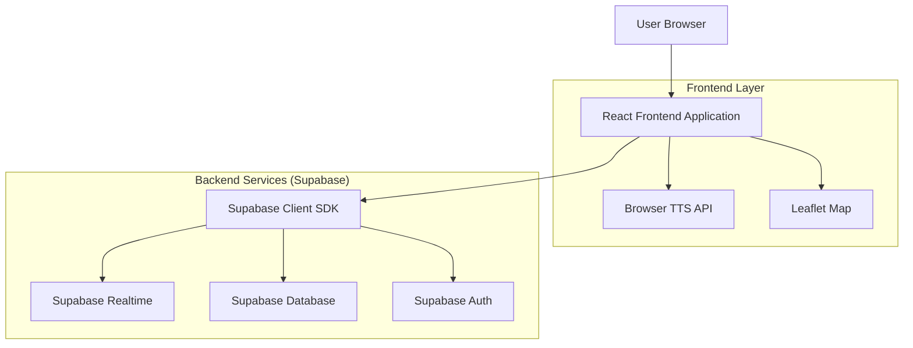
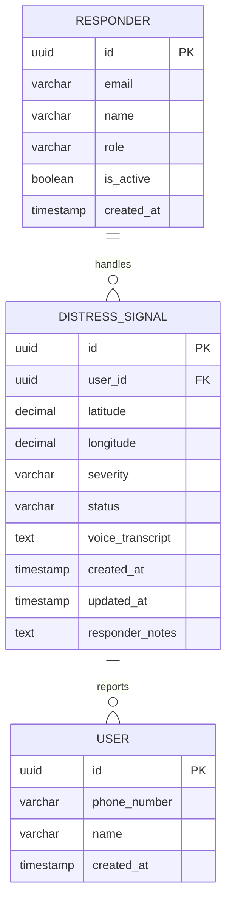

## 1. Architecture design



## 2. Technology Description
- **Frontend**: React@18 + TypeScript + Vite + Tailwind CSS@3
- **Initialization Tool**: vite-init
- **Map Library**: react-leaflet@4 + leaflet@1.9
- **Backend**: Supabase (Realtime, PostgreSQL, Auth)
- **Voice**: Browser Text-to-Speech API (fallback for Agora Web SDK)
- **State Management**: React Context + useReducer
- **UI Components**: Headless UI + Heroicons

## 3. Route definitions
| Route | Purpose |
|-------|---------|
| / | Main dashboard with interactive map and real-time alerts |
| /signal/:id | Individual distress signal details and rescue status management |
| /analytics | Emergency statistics and signal history analytics |
| /login | Emergency responder authentication |

## 4. API definitions

### 4.1 Core API

**Distress Signals - Realtime Subscription**
```typescript
// Subscribe to new distress signals
supabase
  .channel('distress-signals')
  .on('postgres_changes', 
    { event: 'INSERT', schema: 'public', table: 'distress_signals' },
    handleNewSignal
  )
  .subscribe()
```

**Update Rescue Status**
```
POST /api/signals/:id/status
```

Request:
| Param Name | Param Type | isRequired | Description |
|------------|------------|------------|-------------|
| status | string | true | Rescue status: 'pending', 'in-progress', 'resolved' |
| notes | string | false | Additional notes about rescue operation |
| responder_id | uuid | true | ID of responder updating status |

Response:
| Param Name | Param Type | Description |
|------------|------------|-------------|
| success | boolean | Update operation status |
| updated_at | timestamp | Timestamp of update |

### 4.2 Data Types
```typescript
interface DistressSignal {
  id: string
  user_id: string
  latitude: number
  longitude: number
  severity: 'dire' | 'normal'
  status: 'pending' | 'in-progress' | 'resolved'
  voice_transcript: string
  created_at: string
  updated_at: string
  responder_notes?: string
}

interface Alert {
  id: string
  message: string
  severity: 'dire' | 'normal'
  timestamp: string
  location: string
  count: number
}
```

## 5. Server architecture diagram
Not applicable - using Supabase BaaS architecture with direct client SDK integration.

## 6. Data model

### 6.1 Data model definition


### 6.2 Data Definition Language

**Distress Signals Table**
```sql
-- create table
CREATE TABLE distress_signals (
    id UUID PRIMARY KEY DEFAULT gen_random_uuid(),
    user_id UUID NOT NULL,
    latitude DECIMAL(10, 8) NOT NULL,
    longitude DECIMAL(11, 8) NOT NULL,
    severity VARCHAR(20) CHECK (severity IN ('dire', 'normal')) DEFAULT 'normal',
    status VARCHAR(20) CHECK (status IN ('pending', 'in-progress', 'resolved')) DEFAULT 'pending',
    voice_transcript TEXT,
    responder_notes TEXT,
    created_at TIMESTAMP WITH TIME ZONE DEFAULT NOW(),
    updated_at TIMESTAMP WITH TIME ZONE DEFAULT NOW()
);

-- create indexes
CREATE INDEX idx_distress_signals_location ON distress_signals(latitude, longitude);
CREATE INDEX idx_distress_signals_severity ON distress_signals(severity);
CREATE INDEX idx_distress_signals_status ON distress_signals(status);
CREATE INDEX idx_distress_signals_created_at ON distress_signals(created_at DESC);

-- set up Row Level Security
ALTER TABLE distress_signals ENABLE ROW LEVEL SECURITY;

-- policies
CREATE POLICY "Allow read access to all signals" ON distress_signals
    FOR SELECT USING (true);

CREATE POLICY "Allow authenticated responders to update status" ON distress_signals
    FOR UPDATE USING (auth.role() = 'authenticated');

-- grant permissions
GRANT SELECT ON distress_signals TO anon;
GRANT ALL PRIVILEGES ON distress_signals TO authenticated;
```

**Users Table**
```sql
-- create table
CREATE TABLE users (
    id UUID PRIMARY KEY DEFAULT gen_random_uuid(),
    phone_number VARCHAR(20) UNIQUE NOT NULL,
    name VARCHAR(100),
    created_at TIMESTAMP WITH TIME ZONE DEFAULT NOW()
);

-- grant permissions
GRANT SELECT ON users TO anon;
GRANT ALL PRIVILEGES ON users TO authenticated;
```

**Responders Table**
```sql
-- create table
CREATE TABLE responders (
    id UUID PRIMARY KEY DEFAULT gen_random_uuid(),
    email VARCHAR(255) UNIQUE NOT NULL,
    name VARCHAR(100) NOT NULL,
    role VARCHAR(50) DEFAULT 'responder',
    is_active BOOLEAN DEFAULT true,
    created_at TIMESTAMP WITH TIME ZONE DEFAULT NOW()
);

-- grant permissions
GRANT SELECT ON responders TO authenticated;
```

### 6.3 Realtime Configuration
Enable realtime for distress_signals table in Supabase dashboard to allow live updates.

### 6.4 Voice Alert Implementation
```typescript
// Browser TTS implementation
class VoiceAlertSystem {
  private synth: SpeechSynthesis
  
  announceAlert(signal: DistressSignal): void {
    const utterance = new SpeechSynthesisUtterance(
      `Alert: ${signal.severity === 'dire' ? 'critical' : 'standard'} distress signal detected. ${this.getLocationDescription(signal)}`
    )
    utterance.rate = 0.9
    utterance.pitch = signal.severity === 'dire' ? 1.2 : 1.0
    this.synth.speak(utterance)
  }
}
```